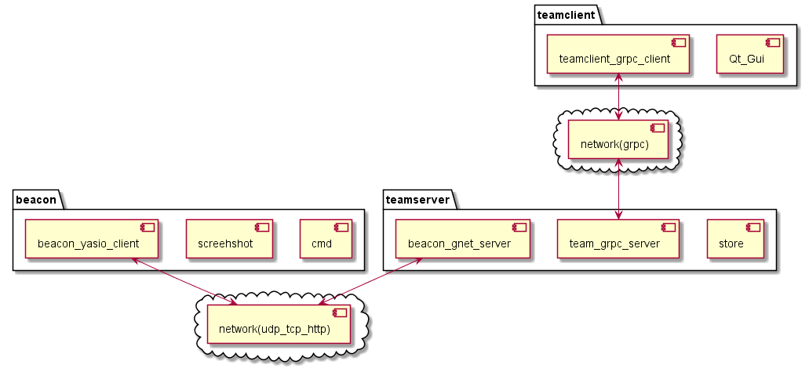
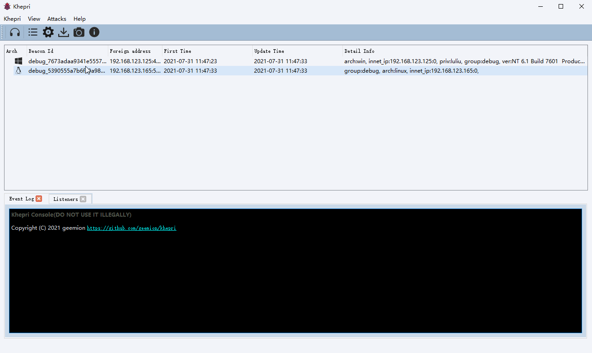

<h1 align="center">

  

  Khepri
   
</h1>

<h5 align="center">Free,Open-Source,Cross-platform agent and Post-exploiton tool written in Golang and C++</h5>

  

### Description
 
Khepri is a Cross-platform agent. It's very basic and only for educational purposes.

----

**Disclaimer**: *This project was created for educational purposes and should not be used in environments without legal authorization. If someone's rights have been violated, please contact me to remove the project, the last DO NOT USE IT ILLEGALLY and author/contributors do not take any responsbility for any damage caused by malicious actors using any software presented herein.*

 

- beacon: Agent, written in C++.
- teamserver: Server, written in Golang.
- teamclient: User client, written in C++, the UI use Qt-GUI.  

### Features

 

- Supported C2 Protocols:
  - [x] TCP
  - [x] UDP
- Fast network serialization (Protocol Buffers)
- Agent Features:
  - [x] System Information
  - [x] Process Manager
  - [x] File Manager
  - [x] Remote Shell
  - [x] Remote Execution

- Supported operating systems

 | System     | Windows   | Linux       | Macos    |
 |------------|-----------|------------ |----------|
 | beacon     | √         | √           |√         |
 | teamserver | √         | √           |√         |
 | teamclient | √         | √           |√         |

### Quick Start

Please see [Quick Start](docs/quick_start.md)

### TODO
- [ ] Refactor teamserver code
- [ ] Beacon supports more protocols:https、dns
- [ ] Beacon supports https-dns 
- [ ] Beacon supports dynamic plugin
- [ ] Beacon support proxy
- [x] ~~Teamclient support proxy~~
- [ ] Support CI
- [x] ~~Beacon and teamclient support macos~~
- [x] Reduce beacon to ~~100kb~~700kb(~~Don't use openssl~~、support Mingw compile(can't reduce size))
...

### Contributing
* Issues and PR are welcome.
* [Khepri contributing format](docs/contributing.md).
