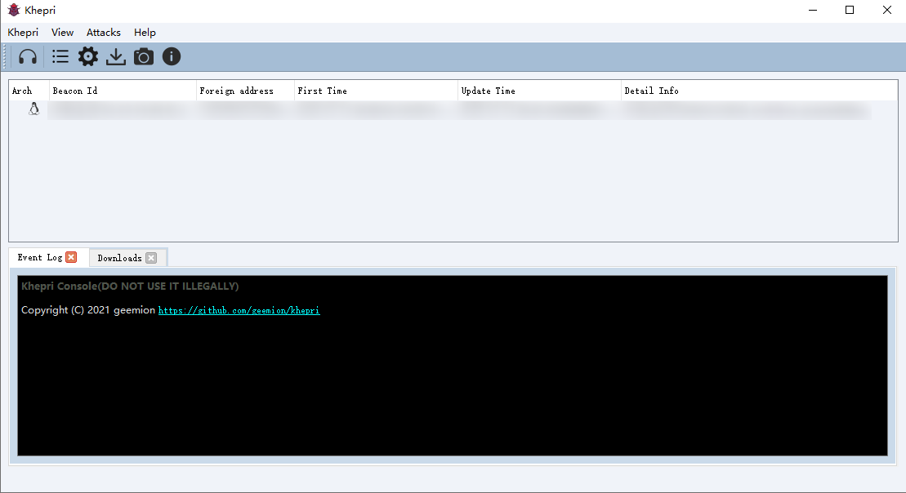

<h1 align="center">
<p align="center">
  
</p>
  Khepri
  <br>
</h1>

<h5 align="center">Free,Open-Source,Cross-platform agent and Post-exploiton tool written in Golang and C++</h5>

### Description

Khepri is a Cross-platform agent, the architecture and usage like Coblat Strike but free and open-source.

----
*This project is for learning Golang and C++ only, if someone's rights have been violated, please contact me to remove the project, and the last DO NOT USE IT ILLEGALLY*

<p align="center">
 
</p>

- beacon: Agent, written in C++.
- teamserver: Server, written in Golang.
- teamclient: User client, written in C++, the UI use Qt-GUI.  


### Features
<p align="center">
 
</p>

- Supported C2 Protocols:
  - [x] TCP
  - [x] UDP
- Fast network serialization (Protocol Buffers)
- Agent Features:
  - [x] System Information
  - [x] Process Manager
  - [x] File Manager
  - [x] Remote Shell
  - [x] Remote Execution

- Supported operating systems


 | System     | Windows   | Linux       | Macos    |
 |------------|-----------|------------ |----------|
 | beacon     | √         | √           |          |
 | teamserver | √         | √           |√         |
 | teamclient | √         | √           |          |


### Quick Start

#### How to compile it(beacon and teamclient)

##### Install compiling tool chain

1.Linux：vcpkg、gcc、g++、cmake
2.Windows:vcpkg、vs2015、cmake

##### Install dependent open source code

**beacon**: yasio、openssl、protobuf
**teamclient**：grpc、qt5-base

yasio: https://github.com/yasio/yasio
Other lib use vcpkg to install, eg openssl vcpkg.exe install openssl:x86-windows-static

https://github.com/Microsoft/vcpkg#quick-start

##### Compile

- git clone https://github.com/geemion/khepri
- beacon:
windows: gen-vc-project.bat
```
cmake ^
    -S . ^
    -B buildvc ^
    -G "Visual Studio 14 2015" ^
    -DCMAKE_SYSTEM_VERSION=8.1 ^
    -DCMAKE_TOOLCHAIN_FILE="[vcpkg root]/scripts/buildsystems/vcpkg.cmake" ^       #edit it
    -DVCPKG_TARGET_TRIPLET="x86-windows-static"

cd buildvc
cmake --build . --target beacon --config MinSizeRel
pause
```

linux:gen-mk-project.sh
```
#!/usr/bin/env bash
rm -rf buildmk/
echo "mkdir buildmk"
mkdir buildmk
cmake -S .\
 -B buildmk\
 -DCMAKE_BUILD_TYPE="Debug"\
 -DCMAKE_INSTALL_PREFIX="/usr/local"\
 -DCMAKE_TOOLCHAIN_FILE="[vcpkg root]/scripts/buildsystems/vcpkg.cmake"\       #edit it
 -DVCPKG_TARGET_TRIPLET="x64-linux"\
 -DCMAKE_MAKE_PROGRAM="make"\
 -DCMAKE_C_COMPILER="gcc"\
 -DCMAKE_CXX_COMPILER="g++"\
 --debug-output

cd buildmk
make
```
- teamclient:
windows: gen-vc-project.bat
```
cmake ^
    -S . ^
    -B buildvc64 ^
    -G "Visual Studio 14 2015 Win64" ^
    -DCMAKE_SYSTEM_VERSION=8.1 ^
    -DCMAKE_TOOLCHAIN_FILE="[vcpkg root]/scripts/buildsystems/vcpkg.cmake" ^       #edit it
    -DVCPKG_TARGET_TRIPLET="x64-windows-static"

cd buildvc64
cmake --build . --target teamclient --config MinSizeRel
pause
```

- CLion:
```
Open the Toolchains settings (File > Settings on Windows and Linux, CLion > Preferences), and go to the CMake settings (Build, Execution, Deployment > CMake). Finally, in CMake options, add the following line:

-DCMAKE_TOOLCHAIN_FILE=[vcpkg root]/scripts/buildsystems/vcpkg.cmake
```


### TODO
- [ ] Beacon supports more protocols:https、dns
- [ ] Beacon supports https-dns
- [ ] Beacon supports dynamic plugin
- [ ] Beacon and Teamclient support proxy
- [ ] Support CI
- [ ] Beacon and teamclient support macos
- [ ] Reduce beacon to 100kb(Don't use openssl、support Mingw compile)
...

### Contributing
Issues and PR is welcome.